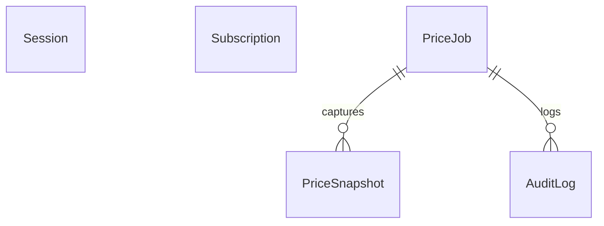

# PricePilot — Bulk Pricing for Shopify

PricePilot helps Shopify merchants change prices across a product catalog safely and quickly. Instead of opening products one by one, a merchant can define matching conditions, preview every affected variant, apply a pricing rule in bulk, schedule a promotion, and roll back the change from a saved snapshot.

It is built for BFCM campaigns, flash sales, seasonal repricing, supplier-cost changes, and any situation where manual price editing is too slow or too risky.

## Why PricePilot exists

Bulk pricing is powerful, but a broad price change can create expensive mistakes. PricePilot is designed around three merchant needs:

- **Speed:** update many variants from one adjustment workflow.
- **Confidence:** see current and proposed prices before anything changes, with currency-aware formatting and safety warnings.
- **Control:** target precisely, protect prices with floor and ceiling limits, schedule campaigns, and restore original values with one-click rollback.

The app changes only variants whose calculated price actually differs, keeps immutable pre-update snapshots, and re-checks the catalog before execution so a stale preview cannot silently update the wrong products.

## What the app does

### Condition-based targeting

Merchants can add multiple conditions and choose whether **all** or **any** conditions must match. Supported fields include tags, product type, vendor, collection, product title, SKU, inventory stock, Main Price, Compare-at Price, and product status.

Operators adapt to the selected field: equality and inequality for discrete values, text contains/not-contains for text, and numeric comparisons for prices and inventory. Tags, types, vendors, collections, and statuses use searchable inline comboboxes. Shopify option lists are fully paginated before filtering, while collection labels are displayed and collection IDs are persisted.

### Flexible price actions

- Percentage increase or decrease
- Fixed-amount increase or decrease
- Set a fixed price
- Psychological rounding to `.99`, `.95`, whole dollars, or the nearest `$10`

Main Price and Compare-at Price can be selected independently or together. Each target uses its own starting value. Empty compare-at prices stay empty unless the merchant explicitly sets a fixed compare-at price.

Compare-at behavior can be `set` (use the original price when discounting), `clear`, or `unchanged`. All calculations use integer cents internally and enforce a system minimum of `$0.01`.

### Preview before applying

**Apply Filters** loads matching variants. The preview includes images, product and variant details, current Main Price and Compare-at Price, and both proposed values. Results are paginated at 50 rows per page and formatted using the store currency.

Changing a condition invalidates the previous preview. Editing the price action recalculates loaded results immediately. Before creating a job, the server re-fetches matches and compares variant IDs and base prices with the preview fingerprint. If the catalog changed, the merchant must refresh the preview.

### Safeguards

Optional price floors and ceilings flag variants outside the permitted range. Safeguards are checked against all matched variants during preview and enforced again during execution. A confirmation modal requires an explicit bypass acknowledgement before a breached job can proceed.

### Scheduling and auto-revert

Pro merchants can schedule an adjustment for a future local date and time and optionally set an end time. Dates are converted from the device time zone to UTC, and start/end ordering is validated. At execution time, scheduled jobs re-evaluate their conditions and prices. When an auto-revert end time arrives, the app restores the saved snapshot.

### Snapshots, rollback, and history

Only changed variants are snapshotted. Original and resulting Main Price and Compare-at Price values are stored in chunks of up to 500 items. Merchants can inspect job details, view price differences, cancel scheduled work, and roll back a completed job with one click. Audit history records the rule, affected count, safeguards, scheduling, status, and operator details.

## Plans

Billing uses Shopify’s GraphQL Billing API for subscription creation and cancellation. Pro access is checked against the store's active Shopify subscription, not a URL parameter or a local database flag.

Before using this billing flow, verify that the app's Partner Dashboard pricing method is **Billing API/manual pricing**. Shopify App Pricing is the default for new public apps and uses a different hosted checkout and Partner API entitlement query. If this app has Shopify App Pricing enabled, this Billing API implementation must be replaced before launch; the two charging flows must not be mixed.

| Capability | Free Starter | PricePilot Pro |
| --- | --- | --- |
| Price adjustments | Up to 50 variants per job | More than 50 variants per job (subject to Shopify API and deployment limits) |
| Percentage and fixed pricing | Included | Included |
| Compare-at synchronization | Included | Included |
| Psychological rounding | Included | Included |
| Manual rollback | Included | Included |
| Scheduled promotions | — | Included |
| Auto-revert | — | Included |
| Floor and ceiling safeguards | Basic validation | Full guards with bypass confirmation |
| Price | Free forever | `$14.99/month`, with a 7-day trial |

## Merchant workflow

1. Open the Adjustment page.
2. Add conditions and choose whether all or any must match.
3. Select the price target and pricing action.
4. Apply filters and inspect the variant preview.
5. Review safeguard warnings and scheduling options.
6. Confirm the adjustment.
7. Monitor progress from the dashboard and job history.
8. Roll back from the job detail page if needed.

## Technical architecture

PricePilot is an embedded Shopify app using Shopify Polaris, App Bridge, React Router, Prisma, and the GraphQL Admin API.

| Layer | Implementation |
| --- | --- |
| Framework | React Router 7.18.3 and React 18 |
| UI | Polaris 13.x and App Bridge 4.x |
| Server and routing | React Router SSR with authenticated Shopify requests |
| Database | Prisma 6.x and PostgreSQL |
| Shopify API | GraphQL Admin API 2026-07 |
| Sessions | Prisma session storage with refresh-token support |
| Updates | Direct, chunked GraphQL mutations |
| Runtime | Node.js 22 or newer |

React Router is pinned to `7.18.3` because `@shopify/shopify-app-react-router@2.1.0` requires React Router `^7.6.2`; this also avoids the iframe/OAuth behavior experienced with Router v8. The embedded entry route redirects authenticated requests to `/app` and preserves the App Bridge headers required inside Shopify Admin.

## Project structure

### Routes

- `app/routes/app.tsx` — Embedded layout, App Bridge navigation, and Polaris provider
- `app/routes/app._index.tsx` — Dashboard, active jobs, scheduled sales, stats, and recent history
- `app/routes/app.adjust.tsx` — Adjustment wizard, preview, safeguards, scheduling, and confirmation
- `app/routes/app.history.tsx` — Job history and audit list
- `app/routes/app.history.$jobId.tsx` — Job details, price differences, schedule cancellation, and rollback
- `app/routes/app.billing.tsx` — Free and Pro plan comparison and upgrade flow
- `app/routes/_index/route.tsx` — Public route and embedded redirect
- `app/routes/api.job-status.tsx` — Active-job polling endpoint
- `app/routes/api.scheduler.tsx` — Due scheduled jobs and auto-reverts
- `app/routes/webhooks.tsx` — HMAC-authenticated Shopify and GDPR webhooks

### Services

- `app/services/price-calculator.ts` — Shared cents-based calculations, rounding, and safeguards
- `app/services/product-conditions.ts` — Condition matching and operator rules
- `app/services/product-filter.server.ts` — Shopify filtering, pagination, and preview retrieval
- `app/services/adjustment-request.ts` and `job-configuration.ts` — Request validation and persisted configuration
- `app/services/preview-fingerprint.server.ts` — Stale-preview protection
- `app/services/bulk-updater.server.ts` — Chunked direct updates and experimental Bulk Operations helpers
- `app/services/snapshot.server.ts` — Snapshot creation and rollback mutations
- `app/services/scheduler.server.ts` — Scheduled execution and restoration
- `app/services/billing.server.ts` — Subscription definitions and Shopify billing
- `app/services/job-manager.server.ts` — Job lifecycle and audit logging

## Data model

The Prisma schema stores Shopify sessions, subscriptions, jobs, snapshots, and audit events. New conditions, match mode, and price targets are serialized into the existing `PriceJob.filters` JSON column, so the redesign does not require a database migration.



`PriceJob` stores the adjustment rule, filters, progress, schedule, safeguards, and status. `PriceSnapshot` stores original and resulting prices for rollback. `AuditLog` records job activity. Existing jobs remain compatible, and history labels understand newer action types and price targets.

## Security and Shopify compliance

- OAuth 2.0 and authenticated sessions are managed by Shopify’s React Router integration.
- Sessions are stored through Prisma, including refresh-token fields required for modern token exchange.
- Only `read_products` and `write_products` scopes are requested.
- Incoming webhooks use HMAC verification.
- GDPR handlers cover `customers/data_request`, `customers/redact`, and `shop/redact`.
- Content Security Policy frame ancestors are restricted to Shopify Admin and the merchant’s store.

## Local development

### Requirements

- Node.js 20+
- A Shopify development store
- Shopify CLI 4.7.x
- A configured Shopify app and database

### Install and run

```bash
npm install
npm run setup
npm run dev
```

Useful commands:

```bash
npm test                 # Unit and UI regression tests
npx tsc --noEmit        # Type checking
npm run build            # Production client and SSR build
npm run lint             # ESLint
npm run deploy           # Deploy through Shopify CLI
```

The web app is configured in `shopify.web.toml` with frontend and backend roles and the React Router development command. Shopify app metadata and scopes are defined in `shopify.app.toml`.

### Production Pro setup and test

1. Deploy the web app to Render with `SHOPIFY_APP_URL` set to its HTTPS URL, a persistent PostgreSQL `DATABASE_URL`, and a strong `CRON_SECRET`. Deploying Shopify app configuration does not deploy the web server.
2. In Render, sync `render.yaml` to create the `pricepilot-scheduler` cron service. Set its `CRON_SECRET` to the **same** value as the web service. The cron calls `/api/scheduler` every minute using a bearer token; it also recovers pending immediate jobs. Inspect its Runs/logs after activation. The scheduler will not run automatically until this separate Render service exists.
3. After confirming Billing API/manual pricing, set `SHOPIFY_BILLING_TEST=true` on a test web deployment and redeploy. Test charges are refused for non-development stores. Do not enable test billing for a merchant-facing production deployment.
4. On the development store, choose **Plans & Billing → Start 7-Day Free Trial**, approve Shopify's test subscription, and verify Pro is shown. Try an adjustment with more than 50 variants, schedule a small sale, check the cron run and price change, then confirm auto-revert. Finally click **Downgrade to Free** and verify Shopify no longer reports an active subscription.

An interrupted price adjustment is marked failed after 30 minutes instead of being replayed automatically, because replaying a percentage adjustment could change already-updated prices twice. Inspect the job and Shopify prices before retrying or rolling back.

## Verification status

The automated suite currently passes, including coverage for percentage and fixed adjustments, compare-at modes, every rounding mode, the `$0.01` clamp, safeguard breaches, condition operators, all/any matching, searchable-option pagination and keyboard interaction, variant pagination, target persistence, stale previews, schedule validation, mutation payloads, mocked execution, billing limits, and snapshot/rollback fidelity.

TypeScript checking and the production build are also clean.

## Current limitations and roadmap

The current preview scans paginated catalog variants and filters them locally. Very large catalogs will need an indexed or Bulk Query-based preview pipeline. A durable worker queue and full Bulk Operations job dispatch remain separate follow-up work, so this app does not promise unlimited catalog throughput or priority processing. Browser testing of billing, cron, and webhooks against a live Shopify development store is still required before merchant launch.

## Shopify references

- [Improved product tags, vendors, and types pagination](https://shopify.dev/changelog/improved-producttags-productvendors-producttypes)
- [Shopify `productTypes` query](https://shopify.dev/docs/api/admin-graphql/2025-10/queries/productTypes)

## License

This project is private and intended for the PricePilot Shopify app.
