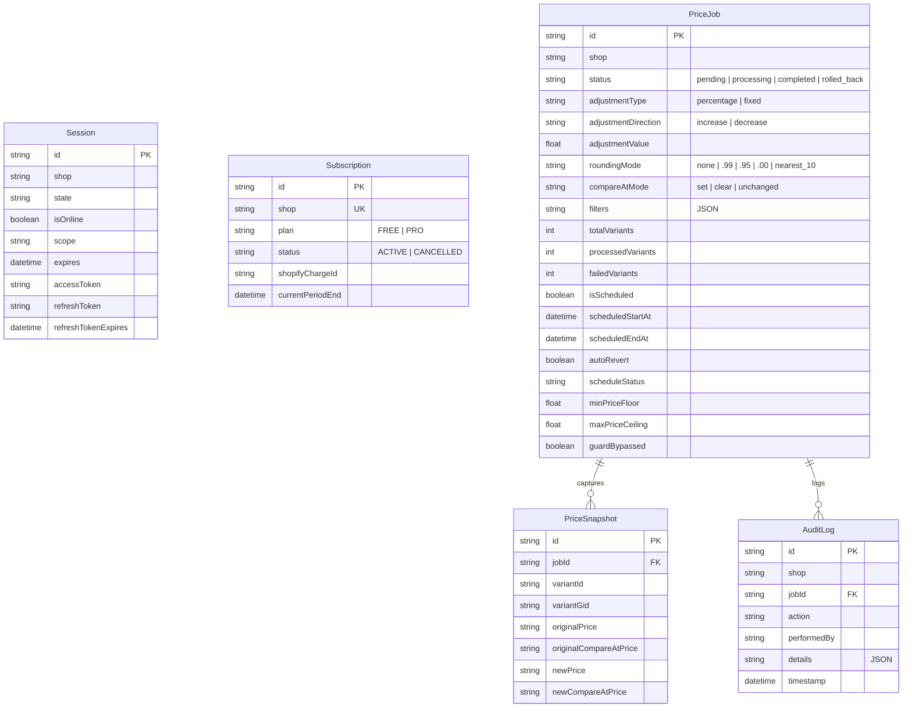

# 🚀 PricePilot ‑ Bulk Pricing — Shopify App Implementation Plan

## New Price Adjustment redesign — September 10, 2026

The adjustment tab now uses the supplied reference layout: condition builder, compact price-action bar, and a full variant preview table. This section describes the current implementation where it differs from the original plan below.

- **Conditions:** Add/remove rows and choose all/any matching. Available fields are tag, product type, vendor, collection, product title, SKU, inventory stock, main price, compare-at price, and product status. Equality/inequality, text contains/not-contains, and numeric comparison operators depend on the selected field.
- **Autocomplete:** Tags, types, vendors, collections, and statuses use searchable dropdowns. Shopify options are paginated completely, then filtered as the merchant types. Collection labels are shown while IDs are persisted. The inputs now use `searchable-condition-value.tsx`, an inline combobox that replaces the Polaris popup after a reported page freeze. Draft text is kept separately from the selected value, and the dropdown has no portal, focus trap, or resize-observer positioning. DOM interaction tests cover typing, selection, keyboard navigation, and continued use of the adjustment page.
- **Price actions:** Percentage increase/decrease, fixed-amount increase/decrease, set to a fixed price, and rounding (.99, .95, whole number, nearest 10). Main Price and Compare-at Price can be selected independently or together; each uses its own starting value. Empty compare-at prices remain empty except when setting a fixed price.
- **Preview:** Apply Filters loads matching variants. The table shows images, product/variant details, both current prices, and both proposed prices, with 50 rows per page and the store's currency. Price-action edits recalculate the loaded results immediately. Changing conditions invalidates the previous preview until filters are applied again.
- **Apply:** The server re-fetches matches and checks a fingerprint of variant IDs and base prices before creating a job. Changed matches/prices require a refreshed preview. The shared calculator and condition matcher drive both preview and execution; compare-at-only changes are included. Only changed variants are snapshotted and updated, and direct mutations are split into at most 250 variants per product/batch.
- **Scheduling and safeguards:** Preserved in an expandable section. Dates are converted from the device's local time zone to UTC, and future start/end ordering is validated. Safeguards are checked against all matched variants and enforced again during execution. Scheduled jobs re-evaluate conditions and prices at their start time.
- **Persistence:** Existing jobs remain compatible. New conditions, match mode, and price targets use the existing JSON filters column; no database migration is needed. History labels understand the new action types and targets.
- **Files:** `app/components/adjustment-editor.tsx` and its CSS module contain the UI; `app/routes/app.adjust.tsx` handles authenticated requests. `product-conditions.ts`, `product-filter.server.ts`, `price-calculator.ts`, `adjustment-request.ts`, `job-configuration.ts`, and `preview-fingerprint.server.ts` implement the shared behavior.
- **Verification:** Expanded regression coverage includes conditions, all/any combinations, autocomplete pagination, variant pagination, every new pricing action, target persistence, stale preview detection, schedule validation, mutation payloads, and mocked job execution. Browser inspection and live Shopify integration verification are still required; no browser was available in the implementation session.
- **Scale limitation:** Exact filtering currently scans paginated catalog variants and returns the matching set for local preview pagination. Large catalogs will need an indexed or bulk-query preview pipeline. Bulk Operations job dispatch and a durable worker queue remain separate unfinished work.

API references: [Shopify product option pagination](https://shopify.dev/changelog/improved-producttags-productvendors-producttypes), [productTypes query](https://shopify.dev/docs/api/admin-graphql/2025-10/queries/productTypes).

---

## App Overview

**PricePilot ‑ Bulk Pricing** is a high-speed, bulk price management app built for Shopify merchants to adjust product catalog prices in **one click**. Whether preparing for BFCM (Black Friday / Cyber Monday), running flash sales, or adjusting for supplier inflation, the app enables merchants to increase or decrease prices across thousands of products in seconds with automatic Compare-at price synchronization, psychological rounding, live preview, safety guards, scheduled sales with auto-revert, and 1-click rollback.

---

## 🏷️ Brand Identity & App Store Metadata

- **App Name**: `PricePilot ‑ Bulk Pricing` (28 characters — fits Shopify's strict 30-character App Store limit)
- **Tagline / Subtitle**: One-click bulk price editor, flash sales, compare-at sync, and instant rollback
- **Package Name**: `pricepilot-bulk-pricing`
- **Configuration**: Configured in [`shopify.app.toml`](file:///c:/Users/SMT/Desktop/Shopify%20Apps/Price%20Adjuster/shopify.app.toml) and [`package.json`](file:///c:/Users/SMT/Desktop/Shopify%20Apps/Price%20Adjuster/package.json)
- **API Scopes**: `read_products,write_products` (least-privilege model for maximum security and fast App Store approval)

---

## 💎 Freemium Business Model & Pricing Architecture

Implemented via Shopify's GraphQL Billing API (`appSubscriptionCreate`) in [`app/services/billing.server.ts`](file:///c:/Users/SMT/Desktop/Shopify%20Apps/Price%20Adjuster/app/services/billing.server.ts) and [`app/routes/app.billing.tsx`](file:///c:/Users/SMT/Desktop/Shopify%20Apps/Price%20Adjuster/app/routes/app.billing.tsx):

| Feature | Free Starter Plan ($0/mo) | PricePilot Pro ($14.99/mo) |
|---|---|---|
| **Catalog Adjustments** | Up to 50 variants per job | **Unlimited variants & products** |
| **Adjustment Types** | Percentage & Fixed dollar amount | Percentage & Fixed dollar amount |
| **Compare-At Synchronization** | ✅ Included (`set`, `clear`, `unchanged`) | ✅ Included (`set`, `clear`, `unchanged`) |
| **Psychological Rounding** | ✅ Included (`.99`, `.95`, `.00`, `nearest_10`) | ✅ Included (`.99`, `.95`, `.00`, `nearest_10`) |
| **1-Click Rollback** | ✅ Manual rollback snapshots | ✅ Manual rollback snapshots |
| **Promotion Scheduling** | ❌ Not included | **⏰ Auto-start sales at future date/time** |
| **Auto-Revert Flash Sales** | ❌ Not included | **↩️ Auto-restore prices when sale ends** |
| **Price Safeguards** | ❌ Basic validation | **🛡️ Floor & Ceiling margin guards + bypass confirmation** |
| **Processing Priority** | Standard | High-priority bulk processing |
| **Free Trial** | Forever Free | **7-Day Free Trial** |

---

## 🧠 Core Feature Specifications

### 1. High-Speed Bulk Pricing Engine
- **Integer Cents Math**: All calculations use integer cents internally in [`app/services/price-calculator.ts`](file:///c:/Users/SMT/Desktop/Shopify%20Apps/Price%20Adjuster/app/services/price-calculator.ts) to eliminate JavaScript floating-point errors (e.g. `19.999999999999996`).
- **System Minimum Safety Clamp**: Enforces an absolute system floor of `$0.01` so prices can never become `$0.00` or negative.
- **Compare-At Synchronization**:
  - `set`: Sets the original price as the `compareAtPrice` when discounting, automatically generating store strikethrough badges.
  - `clear`: Removes compare-at price.
  - `unchanged`: Retains existing compare-at price.

### 2. Smart Psychological Rounding
Conversion-focused retail pricing endings:
- **`.99` Ending**: Formats prices to end in `.99` (e.g., `$19.42` becomes `$19.99`, `$17.00` becomes `$17.99`).
- **`.95` Ending**: Formats prices to end in `.95` (e.g., `$24.12` becomes `$24.95`).
- **`.00` / Whole Dollar**: Rounds to whole dollar (e.g., `$14.60` becomes `$15.00`).
- **`Nearest $10`**: Rounds to the nearest ten dollars (e.g., `$48.00` becomes `$50.00`).

### 3. Price Floor & Ceiling Safeguards with Bypass Confirmation
- **Price Floor ($)**: Prevents accidental price drops below a merchant-defined limit (e.g., `$1.00`).
- **Price Ceiling ($)**: Prevents runaway price spikes above a merchant-defined limit (e.g., `$500.00`).
- **Safety Warning & Bypass**: When prices breach thresholds, the live preview flags breached variants and displays warning banners. The final confirmation modal requires merchants to check an explicit bypass confirmation box before applying.

### 4. Promotion Scheduling & Auto-Revert (Pro Feature)
- **Auto-Start**: Schedule promotional price adjustments for future campaigns (e.g., BFCM midnight launch).
- **Auto-Revert**: When `scheduledEndAt` arrives, the scheduler automatically triggers a snapshot rollback to restore original prices without merchant intervention.
- Managed via [`app/services/scheduler.server.ts`](file:///c:/Users/SMT/Desktop/Shopify%20Apps/Price%20Adjuster/app/services/scheduler.server.ts) and triggered via [`app/routes/api.scheduler.tsx`](file:///c:/Users/SMT/Desktop/Shopify%20Apps/Price%20Adjuster/app/routes/api.scheduler.tsx).

### 5. 1-Click Rollback & Immutable Snapshots
- Captures pre-update prices and compare-at prices in chunked batches (500 items/batch) in [`app/services/snapshot.server.ts`](file:///c:/Users/SMT/Desktop/Shopify%20Apps/Price%20Adjuster/app/services/snapshot.server.ts).
- Reverses prices back to original states at any time with a single click.

---

## 🛠️ Technology Stack & Key Architecture Decisions

| Layer | Technology | Decision Rationale & Resolution |
|---|---|---|
| **Framework** | Shopify CLI 4.7.x + React Router **v7.18.3** | **Pinned to v7.18.3** because `@shopify/shopify-app-react-router@2.1.0` requires `react-router@^7.6.2`. (Resolved v8 OAuth iframe breakout incompatibility). |
| **Frontend UI** | Shopify Polaris 13.x + App Bridge | Native Shopify Admin design system with embedded App Bridge `NavMenu` and Polaris `AppProvider` (`i18n={enTranslations}`). |
| **Web Configuration** | [`shopify.web.toml`](file:///c:/Users/SMT/Desktop/Shopify%20Apps/Price%20Adjuster/shopify.web.toml) | Configured with `roles = ["frontend", "backend"]` and `commands.dev = "npm exec -- react-router dev"`. |
| **Database** | Prisma ORM 6.x + SQLite (dev) / PostgreSQL (prod) | Session storage using `@shopify/shopify-app-session-storage-prisma` v10. Includes `refreshToken` and `refreshTokenExpires` for modern Shopify token exchange. |
| **Shopify APIs** | GraphQL Admin API (2025-10) | Uses dual-engine architecture: direct mutations for small catalogs and Shopify Bulk Operations API (`bulkOperationRunMutation` JSONL) for 100k+ catalogs. |
| **Iframe Handling** | Embedded App Routing | [`app/routes/_index/route.tsx`](file:///c:/Users/SMT/Desktop/Shopify%20Apps/Price%20Adjuster/app/routes/_index/route.tsx) routes embedded requests directly to `/app` to ensure proper App Bridge headers (`frame-ancestors`) and prevent `admin.shopify.com refused to connect`. |

---

## 🗄️ Database Schema Architecture

Located in [`prisma/schema.prisma`](file:///c:/Users/SMT/Desktop/Shopify%20Apps/Price%20Adjuster/prisma/schema.prisma):



---

## 📁 Codebase Structure & Route Map

### 1. Routes & Pages
- [`app/routes/app.tsx`](file:///c:/Users/SMT/Desktop/Shopify%20Apps/Price%20Adjuster/app/routes/app.tsx): Embedded app root layout wrapping Shopify App Bridge `NavMenu` and Polaris `AppProvider` with English translations.
- [`app/routes/app._index.tsx`](file:///c:/Users/SMT/Desktop/Shopify%20Apps/Price%20Adjuster/app/routes/app._index.tsx): **Dashboard** displaying current plan badge, active job alerts, scheduled sales summary, stat cards, and recent history.
- [`app/routes/app.adjust.tsx`](file:///c:/Users/SMT/Desktop/Shopify%20Apps/Price%20Adjuster/app/routes/app.adjust.tsx): **Adjustment Wizard** with 5 configuration steps, real-time safety warnings, live before/after preview, and confirmation modal.
- [`app/routes/app.history.tsx`](file:///c:/Users/SMT/Desktop/Shopify%20Apps/Price%20Adjuster/app/routes/app.history.tsx): **Audit History** listing all jobs with date, rule applied, affected count, features badges (Scheduled, Guards), and status.
- [`app/routes/app.history.$jobId.tsx`](file:///c:/Users/SMT/Desktop/Shopify%20Apps/Price%20Adjuster/app/routes/app.history.$jobId.tsx): **Job Deep Dive** with detailed filter recap, safety guard breakdown, pre-update price diff table, cancel schedule action, and 1-click rollback modal.
- [`app/routes/app.billing.tsx`](file:///c:/Users/SMT/Desktop/Shopify%20Apps/Price%20Adjuster/app/routes/app.billing.tsx): **Plans & Pricing** page comparing Free Starter vs PricePilot Pro ($14.99/mo with 7-day trial) with upgrade flow.
- [`app/routes/_index/route.tsx`](file:///c:/Users/SMT/Desktop/Shopify%20Apps/Price%20Adjuster/app/routes/_index/route.tsx): Public landing route with automatic embedded redirect to `/app`.
- [`app/routes/api.job-status.tsx`](file:///c:/Users/SMT/Desktop/Shopify%20Apps/Price%20Adjuster/app/routes/api.job-status.tsx): Polling endpoint for active background jobs.
- [`app/routes/api.scheduler.tsx`](file:///c:/Users/SMT/Desktop/Shopify%20Apps/Price%20Adjuster/app/routes/api.scheduler.tsx): Cron trigger endpoint for executing due scheduled sales and auto-reverts.
- [`app/routes/webhooks.tsx`](file:///c:/Users/SMT/Desktop/Shopify%20Apps/Price%20Adjuster/app/routes/webhooks.tsx): Unified HMAC-authenticated webhook handler (`app/uninstalled`, `app/scopes_update`, GDPR `customers/data_request`, `customers/redact`, `shop/redact`).

### 2. Services Layer
- [`app/services/price-calculator.ts`](file:///c:/Users/SMT/Desktop/Shopify%20Apps/Price%20Adjuster/app/services/price-calculator.ts): Pure calculation engine (percentages, fixed amounts, rounding, safeguards).
- [`app/services/product-filter.server.ts`](file:///c:/Users/SMT/Desktop/Shopify%20Apps/Price%20Adjuster/app/services/product-filter.server.ts): GraphQL filter generator and sample previewer.
- [`app/services/bulk-updater.server.ts`](file:///c:/Users/SMT/Desktop/Shopify%20Apps/Price%20Adjuster/app/services/bulk-updater.server.ts): Dual-engine updater (direct mutations + Bulk Operations JSONL).
- [`app/services/snapshot.server.ts`](file:///c:/Users/SMT/Desktop/Shopify%20Apps/Price%20Adjuster/app/services/snapshot.server.ts): Pre-update snapshot management and rollback builder.
- [`app/services/scheduler.server.ts`](file:///c:/Users/SMT/Desktop/Shopify%20Apps/Price%20Adjuster/app/services/scheduler.server.ts): Scheduled sales and automatic restoration engine.
- [`app/services/billing.server.ts`](file:///c:/Users/SMT/Desktop/Shopify%20Apps/Price%20Adjuster/app/services/billing.server.ts): Freemium subscription service.
- [`app/services/job-manager.server.ts`](file:///c:/Users/SMT/Desktop/Shopify%20Apps/Price%20Adjuster/app/services/job-manager.server.ts): Job life-cycle orchestration and audit logging.

---

## 🔒 Security & App Store Compliance

- **OAuth 2.0 & Session Security**: Managed by `@shopify/shopify-app-react-router` with encrypted sessions in Prisma.
- **HMAC Webhook Verification**: All incoming webhooks verified with shop secret.
- **GDPR Privacy Compliance**: Endpoints implemented and configured in `shopify.app.toml`.
- **Least-Privilege Scopes**: Only `read_products,write_products` requested.
- **Content Security Policy (CSP)**: `frame-ancestors` dynamically configured to allow embedding strictly from `admin.shopify.com` and the merchant's store.

---

## 🧪 Verification & Test Suite

### 1. Automated Unit Tests (`npm test`)
Run with Node's native test runner:
```bash
npm test
```
**Test Coverage (12/12 passing)**:
- Percentage decrease with compare-at set
- Percentage increase with compare-at unchanged
- Fixed dollar decrease with compare-at cleared
- Psychological rounding (`.99`, `.95`, `.00`, `nearest_10`)
- Floor safeguard breach detection
- Ceiling safeguard breach detection
- Batch safeguard breach summarizer
- System minimum safety clamp ($0.01)
- Rule parameter validator
- Billing plan definitions & limits
- Snapshot & Rollback price inversion fidelity

### 2. TypeScript & Build Checks
- **Type Check**: `npx tsc --noEmit` — 0 errors
- **Production Build**: `npm run build` — Client and SSR bundles compile cleanly
